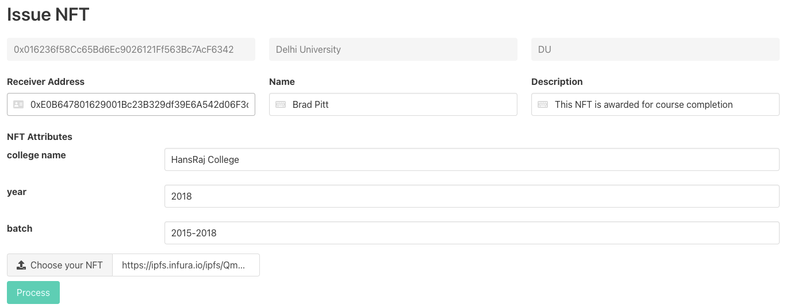

# nft-certificates
Easy NFT creation and management platform.

It enables anyone to:
1. Create their own NFT contract with no coding hustle!
2. Standardize and personalize their NFTs by adding attributes to the NFT.
3. Start issuing NFTs with a simple form! IPFS and JSON uploads already taken care.
3. Instantly view the collection and NFT issued on Opensea
4. Make a great collection of NFTs and share with the world.

## Use cases
1. Startups issuing NFTs to their early adopters
2. College issuing NFTs to their students
3. Receiving NFTs for course completion
4. Competitions issuing NFTs to the winners
5. Easy verification of NFTs on blockchain

## Let's talk Tech (Tech-Talk)

### Initial Requirements:
1. Authority should be able to add the certificate to the blockchain.
2. Only authority should be able to issue the certificate to individuals.
3. Issue certificate as NFT
4. Verify that the certificate is issued to the given address.
5. One address should be able to create more than one NFTs and mint each of them separately.
6. NFTs should be visible on OpenNFT

### Technology used:
1. **Solidity**: Language for writing smart contract
2. Truffle: Framework for Ethereum smart contract development. Provides the compiler for smart contracts.
3. Ganache: Local Ethereum blockchain network with accounts and ether initialized.
4. Metamask wallet: It is a browser extension to store account keys. This Ether is used in deploying/interacting with the contract.
5. Infura: Blockchain development suite, provides set of APIs to connect to Ethereum and IPFS network.
6. Rinkeby: Ethereum testnet. It uses Proof-of-authority.
7. Dotenv: For storing environmental variable constants and accessing them in config. Used to store private keys of wallets
8. Openzeppeline: Boiler plate smart contract code. ERC20 and ERC721 are golden standards for fungible and NFT tokens respectively. This library is most widely used and therefore tested by the industry.

On the front end we have used Javascript and <a href="https://nextjs.org" target="_blank">Next.js</a>: It is a React framework for developing single page Javascript applications. It provides server side rendering and page based routing. 

### Cool stuffs
Use the following plugins, to make your life pretty:
1. IntelliSense for CSS class names in HTML: Cache CSS class definitions and start getting class name suggestion for different HTML tags. Saves a lot of type error.
2. Solidity plugin: Solidity file syntax highlights and compilation. Latest release had some bug, using: v0.0.135
3. Prettier - Code formatter: Saves your precious time correcting indentation.
4. Auto Rename Tag: Auto change the tag pair, time and eye saver.

## Testnet Deployments
1. Main contract address: https://rinkeby.etherscan.io/address/0x49922c934203E1c5d996B150685DDbb87C4FCd9b
2. NFT contract deployed: https://rinkeby.etherscan.io/token/0x016236f58Cc65Bd6Ec9026121Ff563Bc7AcF6342
3. NFT issued: https://testnets.opensea.io/assets/0x016236f58cc65bd6ec9026121ff563bc7acf6342/4

## Screenshots
It is a single page application. Shows messages on success, error and progress. 

Step 1: Connect to the metamask from the button on top-right corner. Once connected, button will change to wallet address string, like shown below:

Step 2: Create your own NFT, by adding name, symbol. Give attributes to your NFT, which will describe each of the minted NFTs better. Attribute names are added in comma separated way

After the NFT contract is successfully created, it will be shown in the table.

Step 3: Once NFT contract is created, click on the issue button in the table. It will open the "Issue NFT" form with attributes fields, as specifies by the NFT creator. 

Note: Only NFT creator wil be able to mint the NFTs.

Once the NFT is successfully issued, message shows the opensea address to open the NFT and the Issue count in the table increases.

## Future Work

1. UI improvements: Convert into multi page application.
2. Connect wallet: Detect when wallet is being disconnected and reload the page.
3. Validations on all the form fields
4. Play with baseURI